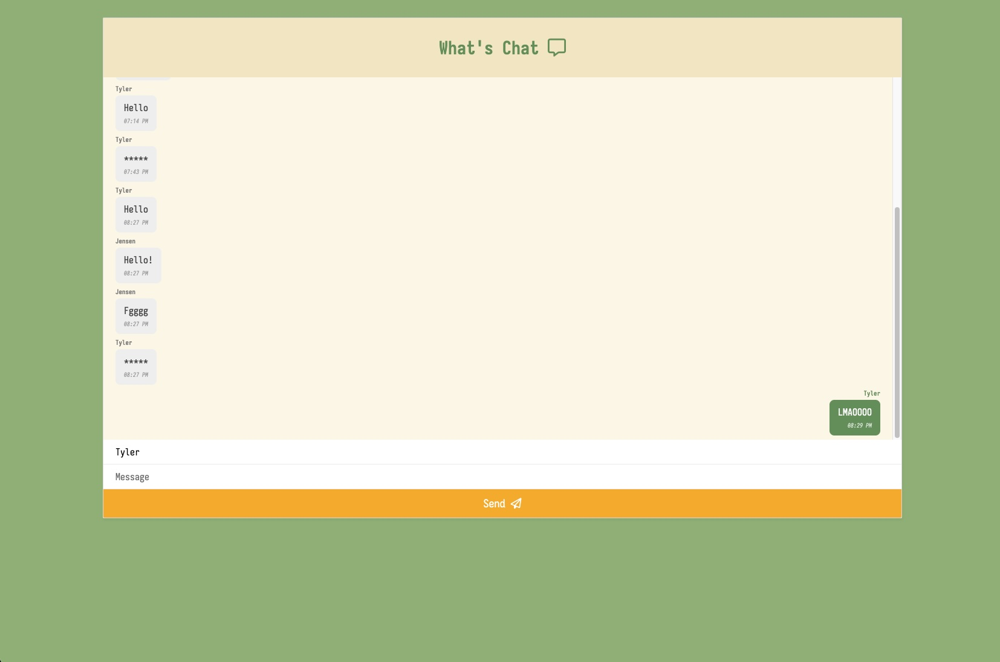

# Websocket practice

- [socket.io Documentation](https://socket.io/docs/v4/tutorial/introduction)
- [TensorFlow Toxicity model](https://github.com/tensorflow/tfjs-models/tree/master/toxicity)
- [firestore Quickstart](https://firebase.google.com/docs/firestore/quickstart)
- [Fonts](https://fonts.google.com/specimen/Iosevka+Charon+Mono)
- [Icons](https://fontawesome.com/icons/paper-plane?f=classic&s=regular)

